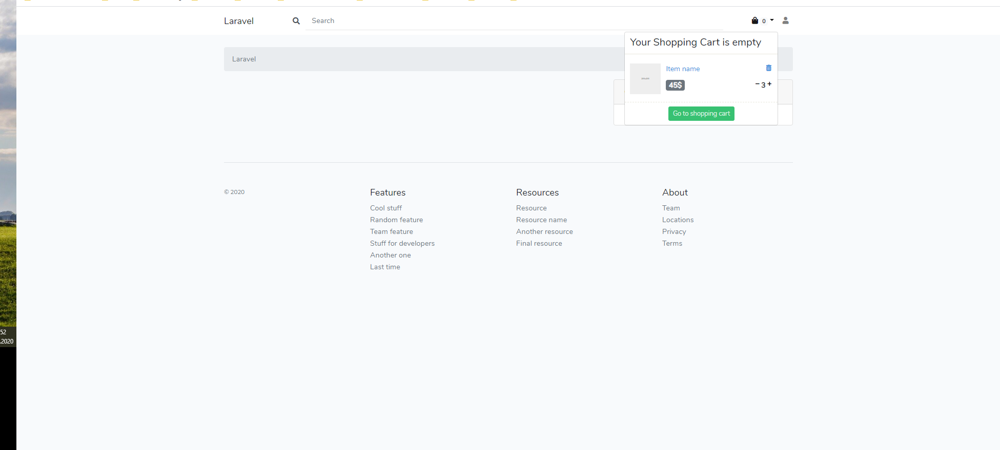

# Simple Ecommerce Laravel & Vue Js

## About

Is an online store management system. It is Laravel-based, using a MySQL database and Vue.js. Support is provided for different languages and currencies.

## What is it? What better?

Nothing better yet, but I'm looking for the best. 
To find the goals and what has already been achieved, you can see the [roadmap](roadmap.md).

## Get started

The installation is the same as Laravel, but for now you need to download the repository or make a clone. After you need to run the command:

`composer update`

And then `npm install`, and you can use this project.

> After the first stable version, the composer will be used.

Will be supplemented...

## License

Is open-sourced software licensed under the [MIT license](https://opensource.org/licenses/MIT).
